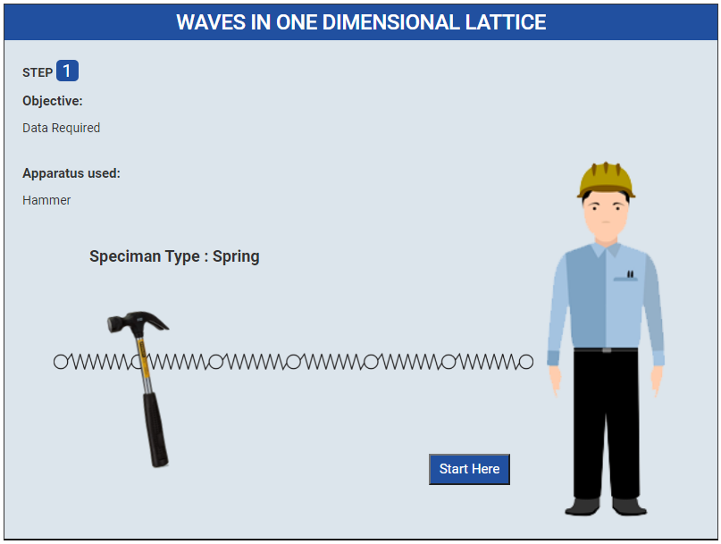
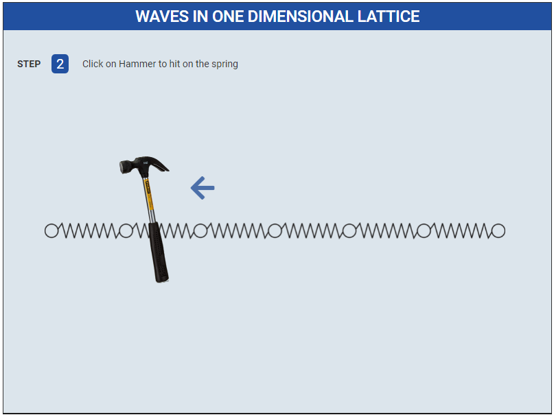
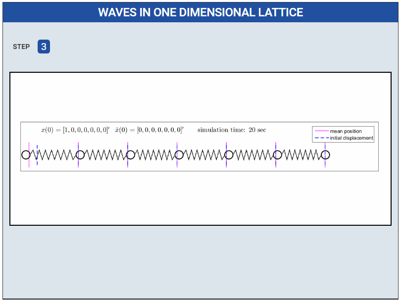

### Procedure

1. Click on Start Here button to start the experiment.
 

2. Click on Hammer to hit on the spring
 

3. Graph
 

<!-- 4. Please Fill all values these are given and Click on Calculate Button
 

5. Show the Graphs
 
 -->

